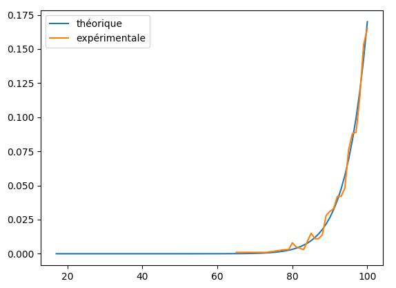

Combinatoire du jeu
===================

Question 1
----------

Pour une grille vide $G \in \{0\}^{m \times n}$ et un bateau de longueur $l$, on peut calculer le nombre de placements possibles du bateau sur $G$, que l'on appelle $n_l$, avec la formule :
$$n_l = (m - l + 1) * n + (n - l + 1) * m$$
Dans le fichier `combinatoire.py`, nous avons défini une fonction `nb_placements_bateau` permettant de calculer $n_l$ en énumérant toutes les combinaisons possibles sur une grille donnée à l'aide de la fonction `Grille.peut_placer`.

En appliquant la formule précédente et en appelant la fonction `nb_placements_bateau` sur une grille vide de taille $10\times10$, on obtient bien des résultats identiques :

   $l$   $n_l$   `nb_placements_bateau`
  ----- ------- ------------------------
    5     120             120
    4     140             140
    3     160             160
    2     180             180

Questions 2,4
-------------

Soit $L \in \{2,3,4,5\}^n$ la liste des longueurs des bateaux dont l'on veut dénombrer les placements sur la grille vide (de taille $10\times10$). On appelle $n_L$ l'approximation de ce dénombrement que l'on calcule avec la formule :
$$n_L = \prod_{i=1}^{n}{n_{L_i}}$$
On a implémenté dans `combinatoire.py` une fonction `nb_placements_liste_bateaux` qui permet d'effectuer le dénombrement à l'aide d'un algorithme récursif. On obtient les résultats suivants :

  $L$         $n_L$     `nb_placements_liste_bateaux`   Temps de calcul (commande `time`)
  ----------- --------- ------------------------------- -----------------------------------
  [5]         120       120                             0.35s
  [5,5]       14400     11920                           0.97s
  [4,3]       22400     20336                           1.21s
  [2,2]       32400     31252                           1.56s
  [5,5,5]     1728000   983520                          60.51s
  [5,4,3]     2688000   1850736                         88.99s

On constate qu'à partir de 3 bateaux, on atteint des temps de calcul beaucoup plus élevés que pour 1 ou 2 bateaux. Cela est très probablement dû au coût en complexité de la récursion, qui comme on peut l'observer expérimentalement implique que le temps de calcul est plus ou moins proportionnel au nombre de cas de base, et donc ici au dénombrement des placements.

Aussi, à part dans le cas où $n = 1$, la mesure approximative donnée par $n_L$ est toujours supérieure au dénombrement réel car elle permet la superposition des bateaux. Cette mesure est d'autant plus approximative que $n$ est grand.

Question 3
----------

Si toutes les grilles sont équiprobables, alors la probabilité de tirer une grille en particulier est de $\frac{1}{N}$, avec $N$ le nombre de grilles calculé à la question 2,4.

On a implémenté dans `combinatoire.py` la fonction `trouve_grille_alea` qui génère des grilles aléatoirement jusqu'à trouver la grille passée en paramètre.

Modélisation probabiliste du jeu
================================

Version aléatoire
-----------------

### Espérance théorique

Dans un premier temps, on cherche à exprimer la loi de probabilité de la variable aléatoire $X$ qui correspond au nombre de coups effectués pour gagner la partie.

Pour ce faire, on peut modéliser notre univers, l'ensemble des grilles de jeu de taille $m \times n$ contenant $k$ tirs réussis ($k$ étant le nombre de cases occupées par les bateaux), comme l'ensemble des séquences de digits binaires $\Omega = \{(c_1,\ldots,c_{m*n}) \in \mathbb{B}^{m*n}\}$.\
Un 1 correspond à un tir réussi, un 0 à un tir raté. La séquence est bien toujours de taille $m*n$ car on élimine les positions déjà jouées (et on complète par des 0 pour les tirs non-effectués car la partie est terminée).

On peut alors exprimer le nombre de grilles de jeu gagnantes en au plus $x$ coups, $|X \leq x|$, comme le nombre de séquences de longueur $x$ contenant $k$ 1, $C^k_x$. On en déduit la loi de probabilité et l'espérance qui s'en suit :

\begin{alignat*}{2}
P(X = x) &= \frac{|X \leq x| - |X \leq x-1|}{|\Omega|}
         &= \frac{C^k_x - C^k_{x-1}}{C^k_{m*n}}
\end{alignat*}
$$E(X) = \sum_{x=k}^{m*n}{P(X = x) * x}$$

Dans notre cas où $k = 17$ et $m*n = 10*10 = 100$, on trouve $E(X) \approx 95,39$.

### Comparaison avec l'espérance expérimentale

On a implémenté dans le fichier `game.py` la fonction `random_play` qui joue aléatoirement au jeu, et renvoie le nombre de coups.

On calcule ensuite la distribution expérimentale en lançant $N = 1000$ itérations de `random_play` à l'aide de la fonction `distribution` dans `modelisation.py`, puis on plot le résultat, avec la ditribution théorique calculée précédemment :

{width=75%}

Les deux distributions semblent donc bien concorder. On observe en effet une espérance expérimentale qui oscille entre 95 et 96 sur plusieurs expériences, et des valeurs qui se rapprochent encore plus de l'espérance théorique lorsqu'on augmente N (nous ne sommes pas allés au-delà de $N = 10000$ pour des raisons de temps de calcul).

<!--$$P(X=x) = \frac{C^{17}_{x} - C^{17}_{x-1}}{C^{17}_{100}}$$-->
