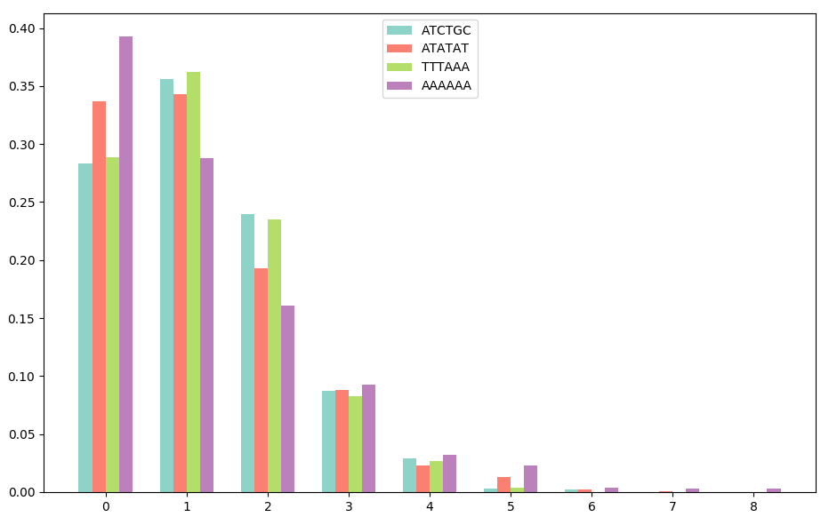

# Préliminaires : données et lecture de fichiers

### Question 2.4

On cherche à calculer la fréquence d'apparition de chaque lettre dans le génome de *S. cerevisae*.

Pour cela nous avons écrit la fonction *`freq_letters`* dans le module *`genoseq`* qui renvoie la liste des fréquences d'apparition des lettres `ACGT` dans le génome (liste d'entiers) passé en paramètre.

On obtient les fréquences suivantes (arrondies à 4 décimales près) sur la séquence lue dans le fichier *`yeast_s_cerevisae_genomic_chr1-4.fna`* :

 `A`      `C`      `G`     `T`
-------- -------- -------- --------
$0.3095$ $0.1915$ $0.1906$ $0.3085$

# Annotation des régions promoteurs

## Description empirique, préliminaires

### Question 3.1.2

Considérons la variable aléatoire $N^l_w$ qui correspond au nombre d'occurrences d'un mot $w$ dans une séquence de longueur $l$.

On cherche à connaître le nombre théorique d'occurrences attendu, c'est-à-dire l'espérance $E(N^l_w)$, sachant qu'on connaît les fréquences d'apparition des lettres dans le génome.

Soit $a \in \{0,1,2,3\}$ la variable correspondant à la notation en nombre entier d'une lettre parmi $\{A,C,G,T\}$.  
On note $p_a$ la probabilité pour $a$ d'être tirée dans un modèle aléatoire de la séquence, qui correspond ici à la fréquence d'apparition de $a$ dans le génome.  
On note $n^w_a$ le nombre d'occurrences de $a$ dans $w$.

On remarque que l'ordre des lettres dans $w$ n'a aucune importance ici, seul le nombre d'occurrences influe sur la probabilité d'apparition de $w$ dans la séquence : on s'attend en effet à avoir moins d'occurrences du mot si celui-ci contient un plus grand nombre de lettres.  

On peut alors calculer la probabilité de tirer $w$ à une position donnée dans la séquence en multipliant les probabilités de tirer chaque lettre $a$ $n^w_a$ fois :
$$\prod_{a}{\left(p_a\right)^{n^w_a}}$$

Pour déterminer $E(N^l_w)$, on cumule la probabilité que l'on vient de calculer pour chaque position possible de $w$.  
Sachant que $w$ est de longueur $\sum_{a}{n^w_a}$ et qu'on a donc $l - \sum_{a}{n^w_a} + 1$ positions possibles, on obtient :
$$E(N^l_w) = \prod_{a}{\left(p_a\right)^{n^w_a}} \times \left(l - \sum_{a}{n^w_a} + 1\right)$$

La formule est implémentée dans la fonction *`expected_counts`* du module *`fixation`* qui l'applique à tous les mots de longueur $k$.

### Question 3.1.3

On cherche à évaluer à quel point les nombres d'occurrences des mots de longueur $k$ observés sur les séquences PHO, MET et GAL s'écartent des nombres d'occurrences théoriques attendus.

Pour cela nous avons implémenté la fonction *`plot_counts`* dans le module *`fixation`* qui nous permet d'afficher un graphe de dispersion du nombre observé en fonction du nombre attendu pour différentes séquences et différentes valeurs de k (fig. @fig:scatter_counts).

{#fig:scatter_counts width=90%}

La droite rouge correspond à l'enrichissement relatif : les points situés au-dessus (resp. en-dessous) de la droite sont les mots dont le nombre d'occurrences observé est supérieur (resp. inférieur) au nombre d'occurrences attendu.

On voit que le nombre d'occurrences observés suit globalement le nombre d'occurrences attendu. Aussi, comme nous l'avions prévu, plus la longueur du mot $k$ est grande, et plus sa fréquence d'apparition est proche de 0.

Néanmoins on remarque un fait intéressant : plus $k$ est grand, et plus on observe un petit nombre de mots bien plus fréquents que les autres.  
Il semble donc que ces mots très fréquents correspondent aux sites de fixation du génome de *S. cerevisae*.

Par la suite nous avons décidé d'expérimenter un peu plus avec ces valeurs en dessinant la distribution du nombre d'occurrences observé sur l'ensemble des mots de taille $k \in \{2,4,6,8\}$ (fig. @fig:distrib_obs_counts).

{#fig:distrib_obs_counts width=90%}

On remarque alors que quelque soit la valeur de $k$, la distribution est très similaire, ce qui ce voit tout particulièrement sur les positions relatives des pics correspondant aux sites de fixation trouvés précédemment.

## Simulation de séquences aléatoires

### Question 3.2.1

On cherche à comparer le nombre d'occurrences observé, c'est-à-dire la moyenne $\overline{N^l_w}$ pour un mot $w$ sur un échantillon de simulations de longueur $l$, et le nombre d'occurrences attendu $E(N^l_w)$ calculé à la question 3.1.2.

Nous avons pour cela implémenté la fonction *`emp_counts`* dans le module *`simul`*, qui étant donnée une liste de comptages de mots sur un échantillon de simulations de longueur $l$, calcule $\overline{N^l_w}$ pour chaque mot.

On compare alors les distributions de $E(N^{5000}_w)$ et $\overline{N^{5000}_w}$ sur l'ensemble des mots de taille 6 sur 1000 simulations sur un modèle équiprobable (fig. @fig:exp_emp_counts).

{#fig:exp_emp_counts width=50%}

Les deux distributions sont très proches, ce qui signifie que notre espérance théorique décrit bien le nombre d'occurrences attendu des mots.

### Question 3.2.2

On cherche à déterminer la probabilité empirique $P_{emp}(N^l_w \geq 1)$ pour un mot $w$ d'apparaître dans une séquence aléatoire de longueur $l$.

Nous avons pour cela implémenté la fonction *`emp_prob_sup`* dans le module *`simul`*, qui étant donnée une liste de comptages de mots sur un échantillon de simulations de longueur $l$, calcule pour chaque mot $P_{emp}(N^l_w \geq n)$ comme le nombre de simulations contenant au moins $n$ occurrences de $w$.

On obtient les probabilités empiriques suivantes pour deux modèles $M_1 = \{A:0.25,\ C:0.25,\ G:0.25,\ T:0.25\}$ et $M_2 = \{A:0.5,\ C:0.1,\ G:0.2,\ T:0.2\}$, toujours sur 1000 simulations de longueur 5000 :

       `ATCTGC`   `ATATAT`   `TTTAAA`   `AAAAAA`
----- ---------- ---------- ---------- ----------
$M_1$ 0.696      0.685      0.721      0.604
$M_2$ 0.183      0.985      0.995      1.000      

### Question 3.2.3

On cherche à déterminer la distribution de probabilité empirique de $N^l_w$.

Nous avons pour cela implémenté la fonction *`emp_prob_dists`* dans le module *`simul`*, qui étant donnée une liste de comptages de mots sur un échantillon de simulations de longueur $l$, calcule la distribution de probabilité empirique pour chaque mot $w$ (fig. @fig:emp_prob_dists).

{#fig:emp_prob_dists width=70%}

On constate que tous les mots possèdent une distribution similaire, et que plus le nombre d'occurrences $n$ est grand, et plus la probabilité $P_{emp}(N^l_w = n)$ est faible.  
On voit aussi qu'au-delà de $n = 7$, la probabilité devient nulle (les barres n'apparaissent pas sur le graphique), ce qui explique la forte probabilité de n'avoir aucune occurrence des mots.  

On décide par la suite de calculer la distribution de probabilité empirique cette fois-ci non pas sur un modèle équiprobable, mais sur le modèle de la séquence PHO (fig. @fig:emp_prob_dists_pho).

{#fig:emp_prob_dists_pho width=70%}

On constate que les seules distributions qui sont similaires sont celles de `ATATAT` et `TTTAAA`, ce qui n'est pas étonnant vu que les deux mots possèdent la même probabilité d'apparaître à une position donnée dans la séquence.

### Question 3.2.4

On cherche à calculer un intervalle de confiance à partir de la probabilité empirique, c'est-à-dire un intervalle $I^x_{\alpha}$ tel que la fréquence théorique $p_x$ de l'évènement $N^l_w = x$ soit comprise dans cet intervalle avec un risque $\alpha \in [0;1]$.

Sur un échantillon de simulations de taille $n$, on sait que la meilleure approximation ponctuelle de $p_x$ est $\widehat{p_x} = f_x = P_{emp}(N^l_w = x) \cdot n$. On a alors :

$$f_x \sim \mathcal{N}\left(p_x;\sqrt{\frac{p_x(1-p_x)}{n}}\right)$$

Si l'on approxime l'écart-type de la loi : $\widehat{\sigma} = \sqrt{\frac{f_x(1-f_x)}{n}}$, sachant qu'on a extrait $t_{\alpha} = z_{\frac{\alpha}{2}}$ de la table de la loi normale centrée réduite, on trouve l'intervalle de confiance :

$$I^x_{\alpha} = \left[f_x - t_{\alpha} \cdot \widehat{\sigma};f_x + t_{\alpha} \cdot \widehat{\sigma}\right]$$

En d'autres termes, on est certain à $100 \cdot (1 - \alpha)$% que la probabilité pour le mot $w$ d'apparaître $x$ fois dans une séquence de longueur $l$ est comprise dans $I^x_{\alpha}$.

\newpage

## Probabilités de mots

### Question 3.3.1

Tout mot non-chevauchant avec lui-même $w$ de longueur $k$ peut apparaître au maximum $l-k+1$ fois dans une séquence de longueur $l$.

Aussi, la probabilité théorique $p_w$ d'avoir un mot à une position donnée dans une séquence a été calculée dans la question 3.1.2 :

$$p_w = \prod_{a}{\left(p_a\right)^{n^w_a}}$$

On a donc dans ce cas $N^l_w \sim \mathcal{B}(l-k+1, p_w)$.

### Question 3.3.2

On sait qu'une loi binomiale de paramètres $n,p$ avec une grande valeur de $n$ et une petite valeur de $p$ peut être approximée par une loi de Poisson de paramètre $\lambda = np$ si $n \geq 100$ et $np \leq 10$. Pour notre loi binomiale, on doit donc avoir :

$$l-k+1 \geq 100 \quad\text{et}\quad p_w\left(l-k+1\right) \leq 10$$

Dans ce cas on peut alors approximer avec la loi de poisson de paramètre $\lambda = p_w\left(l-k+1\right)$ :

$$P(N^l_w = x) = \frac{\lambda^x}{x!}e^{-\lambda}$$

### Question 3.3.3

Nous avons implémenté la fonction *`exp_prob_dists`* dans le module *`prob`*, qui étant donnée une liste de mots de même longueur $k$, un modèle indiquant les fréquences de chaque lettre, et une longueur de séquence $l$, calcule une approximation de la distribution de probabilité théorique de $N^l_w$ à l'aide de la loi de Poisson.

{#fig:exp_prob_dists width=70%}

Pour le modèle équiprobable (fig. @fig:exp_prob_dists), on constate qu'on a une version "lissée" des résultats pour la distribution de probabilité empirique avec exactement la même distribution pour tous les mots, ce qui confirme notre modèle théorique.

Pour le modèle de probabilités de *S. cerevisae*, on constate que les paramètres de notre loi binomiale ne permettent pas l'approximation avec une loi de Poisson, que ce soit en prenant la séquence complète du fichier *`yeast_s_cerevisae_genomic_chr1-4.fna`* ou en tentant une approximation en concaténant les séquences PHO, MET et GAL. Néanmoins on a pu tester avec le modèle de PHO (fig. @fig:exp_prob_dists_pho).

{#fig:exp_prob_dists_pho width=70%}

La distribution est là-aussi proche de la version empirique, ce qui confirme d'autant plus notre modèle théorique.
