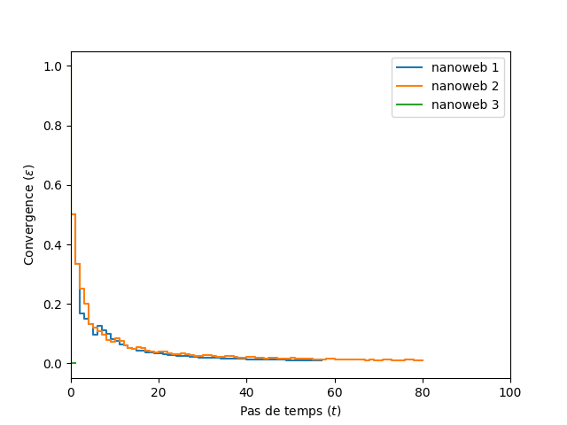
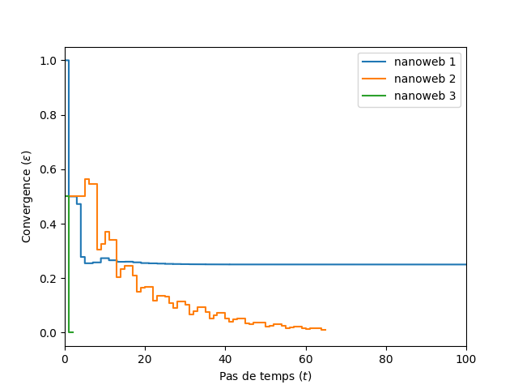
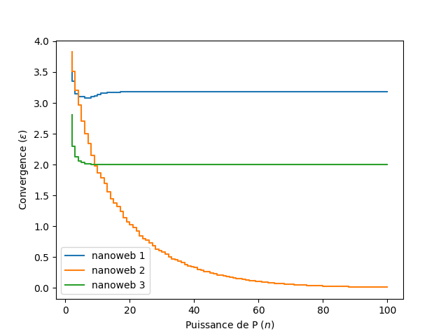

# Simulations

Dans cette partie nous implémentons et testons l'algorithme naïf (classe *`internautes.Internaute`*), qui consiste à simuler aléatoirement le déplacement d'un internaute sur le nanoweb suivant les probabilités de transition du graphe. Cela nous donne au bout d'un certain nombre d'itérations une approximation de la distribution stationnaire, calculée à partir de la fréquence de visite de chaque page.

## Question 3

Une telle simulation est sensible à l'état initial, c'est-à-dire la page de laquelle part l'internaute. En particulier, si l'état initial appartient à un sous-ensemble absorbant (par exemple les pages $\{7,8\}$ dans le nanoweb 1 et les pages $\{4,5\}$ dans le nanoweb 3), alors les autres pages ne seront jamais visitées.  

Plus généralement, dès qu'il y a existence d'un sous-ensemble absorbant, l'internaute va rester bloqué dedans s'il y rentre, nous donnant une fausse mesure de probabilité pour les pages non-visitées en dehors du sous-ensemble. Une façon de pallier ce problème pourrait être de lancer plusieurs simulations en parallèle pour s'assurer qu'un maximum de chemins possibles sont explorés.

Un autre comportement problématique réside dans le fait qu'un nombre limité d'itérations constituera un échantillon peu représentatif pouvant être très éloigné de la distribution stationnaire. Cela induit donc la nécessité d'un très grand nombre d'itérations possiblement coûteuses en calcul (d'autant plus si on adopte la solution de parallélisation des simulations).

## Question 5

On cherche à évaluer l'évolution de la convergence de l'algorithme sur les 3 nanowebs. On se donne pour paramètres l'état initial 1, 10000 itérations, ainsi qu'un seuil de convergence de $0.01$.

On essaie d'abord d'enregistrer la convergence toutes les 100 itérations, mais on réalise qu'avec ces paramètres, l'algorithme converge en moins de 100 itérations. On décide alors d'enregistrer à chaque itération (fig. @fig:epsilons_internaute_t1).

{#fig:epsilons_internaute_t1 width=75%}

On constate que les nanowebs 1 et 2 suivent à peu près la même évolution, bien que le nanoweb 1 converge plus rapidement. En revanche, le nanoweb 3 converge très rapidement, ce qui est dû au fait que les états 0 et 3 sont absorbants, alors que les nanowebs 1 et 2 ne possèdent pas d'état absorbant.

# Vecteurs-matrices

## Question 6

Cette première simulation naïve n'est pas complètement satisfaisante car la distribution de probabilité calculée est biaisée dès que le nanoweb contient un sous-ensemble absorbant. Aussi, on ne peut choisir que $n$ distributions initiales différentes pour un graphe d'ordre $n$.

## Question 7

On remarque qu'une simulation de nanoweb peut être modélisée par une chaîne de Markov. En effet, on a bien :

- Un **processus stochastique d'ordre 1**, avec $(X_n)_{n\in\mathbb{N}}$ les pages successivement visitées par l'internaute lors de son parcours (les pages précédemment visitées n'influençant pas le choix de la prochaine visite)
- **Homogène** : les probabilités de transition sont constantes et forment une matrice stochastique
- À **états finis** : même l'internet n'est pas infini !

On peut alors appliquer l'équation matricielle de transition pour calculer le vecteur d'état (distribution de probabilité) à chaque pas de temps :

$$\pi_{t+1} = \pi_t \cdot P$$

## Question 8

On a donc implémenté un nouvel algorithme exploitant cette propriété calculatoire des chaînes de Markov (classe *`internautes.Kolmogogol`*), que l'on applique avec les mêmes paramètres que précédemment sur les 3 nanowebs (fig. @fig:epsilons_kolmogogol_t1).

{#fig:epsilons_kolmogogol_t1 width=75%}

On observe alors des courbes d'évolution assez différentes du premier algorithme. Comparons pour chaque nanoweb :

Nanoweb 1
: On constate que notre nouvel algorithme ne converge pas (cela n'apparaît pas sur le graphique, mais la courbe se poursuit jusqu'aux 10000 itérations limite). Cela est dû au fait que les pages $\{7,8\}$ constituent une sous-chaîne périodique, la distribution de probabilité alternant à chaque itération entre ces deux états.

Nanoweb 2
: La progression est la même que pour l'algorithme naïf, bien que beaucoup moins stable et convergeant plus vite.

Nanoweb 3
: On converge aussi très rapidement à cause des états absorbants.

On peut maintenant avec cette algorithme choisir n'importe quelle distribution initiale, ce qui nous permet par exemple de modéliser un cas uniforme où l'internaute peut démarrer sa navigation sur n'importe quelle page avec la même probabilité.

# Puissances de matrices

Pour tout $n \in \mathbb{N}$, la puissance de la matrice de transition $P^n$ représente les probabilités de transition du graphe en $n$ itérations.

## Question 9

On a implémenté dans *`datastructures.SimpleWeb.convergence`* un algorithme permettant de calculer l'évolution de la convergence des puissances de $P$. On utilise pour cela un nouvel estimateur :

$$\epsilon = \left\|P^{t} - P^{t+1}\right\|$$

On dessine alors la courbe d'évolution de la convergence pour les 3 nanowebs avec pour seuil $\epsilon \leq 10^{-10}$ (fig. @fig:epsilons_trans).

{#fig:epsilons_trans width=75%}

On constate que les 3 nanowebs convergent avec une progression très similaire en exactement 7 itérations, à partir de $P^8$, ce qui est bien plus rapide que la convergence de la distribution de probabilités, malgré la très petite valeur du seuil de convergence.

# Génération de Webs

## Question 10
